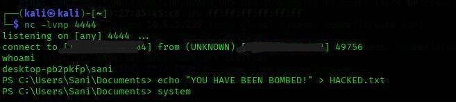
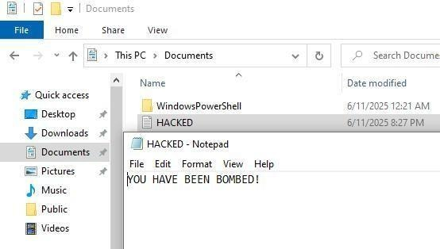
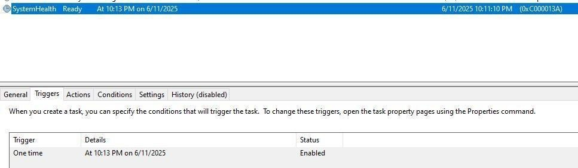

# 💣 Logic Bomb 

This project is a controlled lab simulation of a **Logic Bomb** a stealthy, post-exploitation payload designed to demonstrate how attackers maintain access and manipulate compromised systems. Developed as part of an Operating Systems and Cybersecurity course, the project focuses on understanding adversarial techniques and system-level behavior in Windows environments.

## 📁 Project Overview

The Logic Bomb simulates how a Windows system might be compromised using multiple post-exploitation techniques:

- **Reverse Shell (PowerShell)** – Establishes a connection from victim to attacker.
  
  
  
  
  
- **Persistence via Task Scheduler** – Automatically re-executes payloads upon user login.
  
  
  
- **Visual Payloads** – Modifies wallpaper, shows message boxes/pop-ups for impact simulation.
  
- **Spoofed Executable Delivery** – Delivered via phishing, disguised as a legitimate EXE.
- 
    
  
- **Process Masquerading** – Mimics trusted system processes to evade detection.
  
   
  
- **Windows API Misuse** – Calls native APIs for stealth and evasion.

---

## 🧪 Lab Setup

- **Attacker Machine:** Kali Linux (Virtual Machine)
- **Victim Machine:** Windows 10 (Virtual Machine)

The attack chain was simulated entirely in a lab through email phishing.

